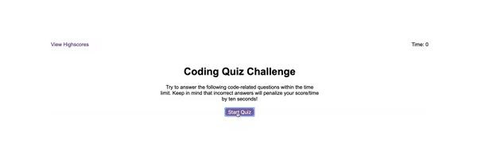

# Homework_4_Web_APIs
Creating a Code Quiz:
A timed coding quiz with multiple-choice questions.

## Getting Started Early!
This week's homework is starting from scratch. Learning from the last 'from scratch' homework, thought it would be best to as early as I can.
We have finished only one class this week, second class on Web APIs is tonight. So I thought i could at least make my plan of attack and set up my HTML and CSS. As they will be pretty easy to get out of the way. 


## User Story

```
AS A coding boot camp student
I WANT to take a timed quiz on JavaScript fundamentals that stores high scores
SO THAT I can gauge my progress compared to my peers
```

## Acceptance Criteria

```
GIVEN I am taking a code quiz
WHEN I click the start button
THEN a timer starts and I am presented with a question
WHEN I answer a question
THEN I am presented with another question
WHEN I answer a question incorrectly
THEN time is subtracted from the clock
WHEN all questions are answered or the timer reaches 0
THEN the game is over
WHEN the game is over
THEN I can save my initials and my score
```

## Mock-Up

The following animation demonstrates the application functionality:


Lets break down each section

### Coding Quiz Home Page



### Questions


### Highscore


## The Breakdown

HTML:
- pretty basic layout


The timer: A timer that counts down from 75
- Top right-hand corner. Not in header but in body. Or in header but with a very large padding or margin.
- homepage set time as 0
- starts on first question
- the score is the time you have left.

Highscores: Score is the time you have left.
- view highscore is set in top left hand-corner, inline with timer
- view highscore is there through out the questions
- Once the quiz is done, it takes your final score and you enter your initials
- Highscore page comes up with a list of highscores
- Format is 1. AB - ##
- You have two selections
    - go back to main page
    - clear highscores


## Next time

Improvements I would make:
Have a range of different questions so you could quiz yourself
- would randomly choose 10 questions each time out of a larger selection.
Another option would be having a few different areas
- quiz on HTML, CSS, JavaScript.
If I have time, perhaps I will make this too. Would be a good way to study and also have a refresher quiz!

